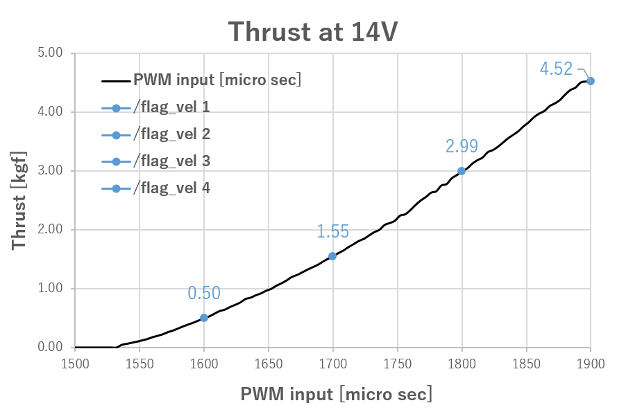

# Underwater Suction Gripper (USG) package
This is a ROS package for controlling the USG.

# 0. Dependency
- Ubuntu 16.04, 18.04 (Debugged)
- ROS kinetic, melodic (Debugged)

# 1. Features
- **Constant** output of thrust.
- **Continuous** output of thrust.

**Thruster (Continuous control by DS4)**


# 2. Installation
## 2.1 Hardware
This package assumes connecting a thruster and gripper to **Raspberry Pi GPIO**.
Please refer to the following sites for parts installation and circuit wiring.
- Thruster (use 13pin)
  - https://bluerobotics.com/store/thrusters/t200-thruster/

EX) Thruster circuit


## 2.2 Software
**Step1 Make the raspi storage to a new SD card**

You can download raspi img file zip from [here](https://drive.google.com/drive/folders/1_n5wU1cHDeiD3O8nzzONRza-W1F2eZ3_?usp=basharing).
```bash
# Check your device path
$ sudo fdisk -l
  /dev/mmcblk0
# Unzip the img file and copy to a new SD card.
$ gzip -dc /home/user name/comapanion_ROS.gz | sudo dd bs=1M of=/dev/mmcblk0
```
If you've already had a raspi warkspace, you can skip above process.
But, in that case, don't forget edit `.bashrc` and git clone this repo.
Set your laptop's IP address to `192.168.2.1`
```bash
# ssh conection to Rasberrypi.
$ ssh pi@192.168.2.2
type passward (default is **companion**)

# In .bashrc file, add the following
$ vim .bashrc
export LD_LIBRARY_PATH=/usr/local/lib/
export PATH=$PATH:~/.local/bin
source /opt/ros/kinetic/setup.bash
export ROS_IP=192.168.2.2
export export ROS_MASTER_URI=http://192.168.2.1:11311
```

**Step2 Initial setting in Raspi**
```bash
# git clone and build
$ cd catkin_ws/src
$ git clone https://github.com/kumahika/usg.git
$ cd ..
$ catkin_make or catkin build

# Grant execute permission
$ cd ~/catkin_ws/src/usg/scripts
$ chmod +x thruster_static.py
# change all scripts that you need
```

# 3. ROS API (Usage)
## 3.1 Nodes
- `thruster_static` node
 This node can control a thruster by static output.
 The output is fixed according to the rotation speed by adjusting the parameters.




- `thruster_dynamic` node

 The debug of this node is being sorted out now.


EX)
```bash
# In the laptop
$ export ROS_IP=192.168.2.1
$ export export ROS_MASTER_URI=http://192.168.2.1:11311
$ roscore

# In the raspi
# Execution of a thruster (Static output)
$ roslaunch usg thruster_static.launch

# Execution of a thruster (Continuous control by DS4)
$ roslaunch usg thruster_dynamic.launch

```

<!--If you use it with joy_screw_controller, you can control screw easily using DS4

-->

## 3.2 Topics
- thruster/pwm (std_msgs/int64) : Sequential commands
  - Stop : 0
  - Incriment : 1
  - Decriment : 2

## 3.3 Prameters
- /thruster/flag_vel (int, default: 2) : The command for the desired thrust (see table above)

EX)
```bash
$ rosparam set /thruster/flag_vel '2'
```

# Publication
- Hikaru Kumamoto, Naoki Shirakura, Jun Takamatsu and Tsukasa Ogasawara:"Underwater Suction Gripper for Object Manipulation with an Underwater Robot," In proceedings of IEEE International Conference on Mechatronics 2021 (ICM2021), 2021 (Preprint)

# Appendix
- Video Clips ([YouTube](https://youtube.com/playlist?list=PLjGy5E68X9kCcfHyGMgnrMzXNDp-tnRuC))

- 3D Model ([stl files](model))

# Author/Contributors
Please feel free to ask any questions and comments!

[Hikaru Kumamoto](https://kumahika.github.io/research/)

[Naoki Shirakura](https://github.com/naoki-sh)   
